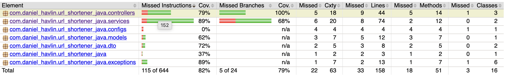

# URL Shortener

This URL shortener was made purely for educational purposes. I wanted to increase my skills in testing and test driven development. It was meant to kick off the proverbial rust of my Java Spring skills, which quickly came flooding back to me after the past few months of me typing a ton of Swift.

It is an incredibly basic URL shortening service that takes a full length url, checks to see if it's a valid URL, if it's a function URL, uses Google's SafeBrowsing API to see if it's a malicious URL, and of course it checks to see if the URL has already been shortened or not. It creates a random six digit hexadecimal number for the short code, for example a3C1da.

I've done my best to test every method within this application, which luckily for me there weren't too many functions to test. There is more test code than actual code in this app! Trying to get the test code coverage to an industry standard of 80% proved to be a bit more challenge than I anticipated, but I have succeeded. This small app does show the complete testing triangle, with my pure functions tested with unit tests, any functions or classes that required dependencies were mocked. When mocking felt like I was "cheating" I performed an integration test to prove my systems actually worked together and I wasn't just mocking to win. Then finally, since this is technically a web app, I introduced Selenium for some end-to-end testing complete with a Page Object Model. I feel pretty satisfied with me work.



## Tech Stack

- Java 21+
- Spring Boot 4
- Spring Data JPA
- Spring Web
- H2 Database
- JUnit 5
- Mockito
- Selenium

## Getting Started

### Prerequisites

- Java 21 or higher
- Maven

### Setup

1. Clone the repository
   ```bash
   git clone https://github.com/dhav211/springboot_url_shortener.git
   cd springboot_url_shortener
   ```

2. Set your Google Safe Browsing API key as an environment variable
bash

`export GOOGLE_SAFE_BROWSING_API_KEY=your_api_key_here`

Or add to application.properties:

```application.properties
google.safe-browsing.api-key=your_api_key_here
```

3. I chose to stick with the basic in memory H2 database as this is small project that I would never consider wasting any space on a server somewhere.

4. Build and run
   ```bash
   mvn spring-boot:run
   ```

The application will start on `http://localhost:8080`

## API Endpoints
This is an ultra-simple application, at this point in time we have just 2 end points:
- `POST /shorten`
  ```json
    {
    "url": "https://www.thisisanaddress.com/to/a/realllllly/longurl/"
    }
  ```
  ```json
    {
    "shortCode": "359ae7",
    "fullUrl": "https://www.boredpanda.com/social-mental-issues-illustrations-sonostatachiara-part-4/"
    }
    ```

- `GET /{shortCode}` - Redirect to an URL

## Testing

Run tests with:
```bash
mvn test
```

Test coverage includes:
- Unit tests for service layer
- Integration tests for repositories
- Controller tests with MockMvc
- Selenium web driver tests

## Learning Goals

- Spring Boot fundamentals
- Test-driven development (TDD)
- JPA/Hibernate
- Spring Data repositories
- REST API design
- Junit/Mockito
- Selenium
